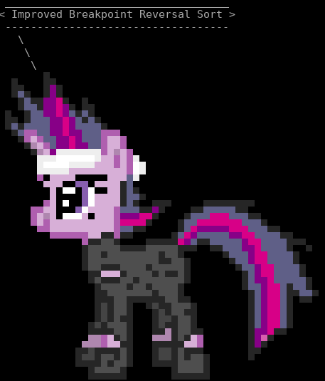
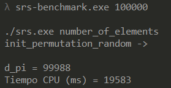

# Sorting by Reversals for Reversal Distance Problem on Bioinformatics
Implement the algorithms SimpleReversalSort and ImprovedBreakpointReversalSort. 

 

## Data
/hard.data

## Structure
<pre>
	/srs.cpp - SimpleReversalSort
	/srs-benchmark.cpp - SimpleReversalSort Benchmark
	/ibrs.cpp - ImprovedBreakpointReversalSort
</pre>

## Compilation (x64 Native Tools Command Prompt for VS 2017 or g++)
cl srs.cpp  
g++ srs.cpp -O3 -o srs

## Execution
srs.exe < input.data  
srs-benchmark.exe 100000  
ibrs.exe < ibrs-clase.data

## Results
Improved Breakpoint Reversal Sort 
 
 

## Downloads
- All: https://github.com/nextco/sorting-by-reversals/archive/master.zip
